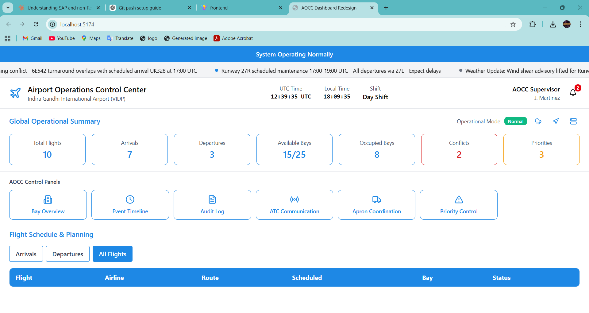
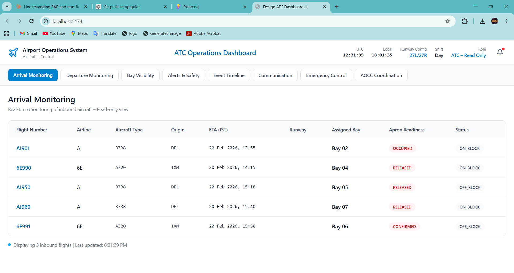
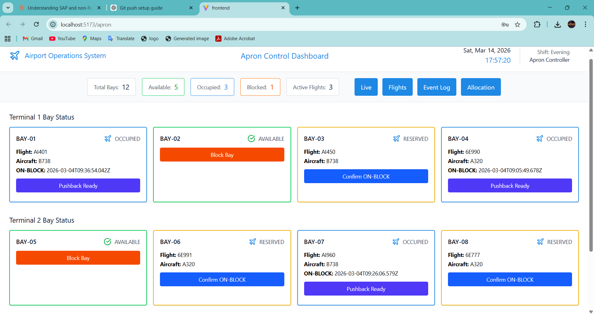

# ✈️ Airport Bay Allocation System

## 🔥 About
<<<<<<< HEAD
The **Automated Airport Bay Allocation & Management System** is a full-stack web application designed to simulate real-world airport ground operations and aircraft stand allocation.

The system intelligently assigns airport bays (gates) to aircraft and enables coordination between multiple airport operational teams including **AOCC (Airport Operations Control Center), ATC (Air Traffic Control), Apron Control, and Airline Operations**.

It helps monitor aircraft movements, manage bay allocations, detect operational conflicts, and improve aircraft turnaround efficiency with real-time operational visibility.
=======
A full-stack web application that intelligently assigns airport bays/gates 
to flights in real-time. It simulates real-world airport ground operations 
and provides operational dashboards for airport teams to monitor aircraft 
movements, manage bay allocations, and coordinate airport activities.
>>>>>>> dd577ac (Updated README and removed merge conflict)

---

## 🛠️ Tech Stack
<<<<<<< HEAD

- **Frontend:** React.js, TypeScript, Tailwind CSS  
- **Backend:** Node.js, Express.js  
- **Database:** PostgreSQL  
- **API:** RESTful APIs  
- **Tools:** Git, GitHub, Postman, VS Code

---
=======
- **Frontend:** React.js, Tailwind CSS, TypeScript
- **Backend:** Node.js, Express.js
- **Database:** PostgreSQL
- **API:** REST API
>>>>>>> dd577ac (Updated README and removed merge conflict)

---

## ✨ Features
<<<<<<< HEAD

- 🛬 Automated aircraft bay allocation system
- 📊 AOCC operational dashboard for airport control
- 🛫 ATC dashboard for arrival & departure monitoring
- 🚧 Apron control dashboard for aircraft ground movement
- ✈️ Airline dashboard for flight management
- 🔄 Real-time bay status monitoring (Available / Occupied / Blocked)
- ⚠️ Conflict detection for overlapping bay allocations
- 📋 Event logging for ON-BLOCK / OFF-BLOCK updates
- 🔔 Operational alerts and notification system
- 🔐 Role-based dashboards for airport stakeholders
- 📱 Responsive interface for operational monitoring

---

## 🧑‍✈️ Operational Dashboards

### AOCC Dashboard
Central control system managing:
- Aircraft bay allocation
- Flight scheduling
- Operational alerts
- Conflict detection
- Coordination between airport departments

### ATC Dashboard
Handles aircraft movement monitoring:
- Arrival and departure tracking
- Landing sequence monitoring
- Operational status updates
- Coordination with AOCC

### Apron Dashboard
Manages aircraft on the apron area:
- Bay status visibility
- Aircraft parking positions
- Pushback readiness
- ON-BLOCK / OFF-BLOCK event confirmation

### Airline Dashboard
Provides airlines with:
- Flight schedule monitoring
- Assigned bay visibility
- Delay tracking
- Operational coordination with AOCC

---
=======
- 🛬 Assign and manage airport bays/gates to flights
- 📊 AOCC dashboard for airport operations control
- 🛫 ATC dashboard for arrival and departure monitoring
- 🚧 Apron dashboard for ground movement management
- ✈️ Airline dashboard for flight management
- 🔄 Real-time bay status monitoring
- ⚠️ Conflict detection for overlapping bay allocations
- 📱 Responsive design for all screen sizes
- 🗄️ PostgreSQL database for reliable data storage
- 🔗 RESTful API integration between frontend and backend
>>>>>>> dd577ac (Updated README and removed merge conflict)

---

## 📸 Screenshots

<<<<<<< HEAD
<!-- Add screenshots of your dashboards below -->

=======
### AOCC Dashboard

### ATC Dashboard

### Apron Dashboard

### Airline Dashboard

>>>>>>> dd577ac (Updated README and removed merge conflict)

---

## 🚀 Live Demo
<<<<<<< HEAD

=======
>>>>>>> dd577ac (Updated README and removed merge conflict)
🔧 Deployment in progress — coming soon on **Vercel**

---

## ⚙️ How to Run This Project Locally

### Prerequisites
- Node.js installed
- PostgreSQL installed and running
- Git installed

### Steps

# Clone the repository
git clone https://github.com/chandru-stack/airport-bay-allocation.git

# Navigate to project folder
cd airport-bay-allocation

<<<<<<< HEAD
# Backend Setup
=======
# Backend setup
>>>>>>> dd577ac (Updated README and removed merge conflict)
cd backend
npm install
npm start

<<<<<<< HEAD
# Frontend Setup
=======
# Frontend setup
>>>>>>> dd577ac (Updated README and removed merge conflict)
cd frontend
npm install
npm run dev

---

<<<<<<< HEAD
## 🏗️ System Architecture

The platform follows a **client-server architecture**:

React Frontend  
⬇  
Node.js + Express Backend  
⬇  
PostgreSQL Database  

Frontend dashboards communicate with backend services through **REST APIs**, while the backend processes operational logic and manages aircraft bay allocations.

---

## 🎯 Purpose of the Project

This project demonstrates how modern web technologies can be used to build an **airport operations management system** that supports:

- real-time operational monitoring  
- airport resource optimization  
- coordinated decision-making between operational teams  

---

=======
>>>>>>> dd577ac (Updated README and removed merge conflict)
## 👨‍💻 Author

**Chandru S**

📍 Chennai, India  

💼 LinkedIn  
https://www.linkedin.com/in/chandru-cr64  

🐙 GitHub  
https://github.com/chandru-stack  

---

<<<<<<< HEAD
⭐ If you like this project, consider giving it a **star on GitHub!**
=======
⭐ If you like this project, give it a **star on GitHub!**
>>>>>>> dd577ac (Updated README and removed merge conflict)
